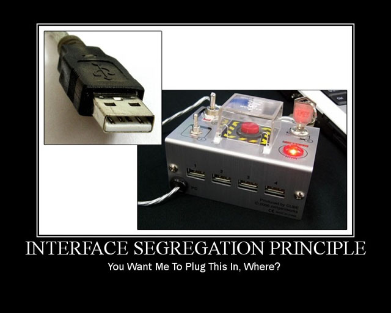

# 🎯 SOLID com Go

---

> "Os princípios SOLID não são regras, são ferramentas que podem ajudar você a criar software mais sustentável."  
> — Robert C. Martin (Uncle Bob)

---

## 🎬 Introdução ao SOLID em Go

**📋 O que é SOLID?**
- Princípios de design de software criados por Robert C. Martin
- Adaptados para Go, priorizando composição e interfaces
- Foco em código limpo e sustentável

**🎯 Por que usar SOLID?**
- Código mais legível e testável
- Redução de acoplamento
- Facilita manutenção e evolução

**📌 Agenda:**
1. S - Single Responsibility Principle
2. O - Open/Closed Principle  
3. L - Liskov Substitution Principle
4. I - Interface Segregation Principle
5. D - Dependency Inversion Principle

---

## ⚡ Single Responsibility Principle


**📖 Conceito Original:**
"Uma classe deve ter apenas uma razão para mudar"

**🔄 Adaptação para Go:**
"Uma struct ou função deve ter uma única responsabilidade bem definida. Use composição ao invés de herança para combinar comportamentos."

**🎁 Benefícios em Go:**
- Structs e funções mais coesas
- Facilidade em testes unitários
- Manutenção simplificada
- Melhor reusabilidade através de composição

```go
// Exemplo problemático
// POO tradicional: métodos misturam lógica de negócio, persistência e comunicação na mesma struct
// Go desencoraja esse acoplamento, preferindo funções e structs especializadas
type Order struct {
	items []string
	prices []float64
}

func (o *Order) AddItem(item string, price float64) {
	o.items = append(o.items, item)
	o.prices = append(o.prices, price)
}

func (o *Order) CalculateTotal() float64 {
	total := 0.0
	for _, price := range o.prices {
		total += price
	}
	return total
}

// 🚨 Mistura responsabilidades!
func (o *Order) ProcessPayment() {}
func (o *Order) SendEmail() {}
func (o *Order) SaveToDatabase() {}
```

```go
// Exemplo corrigido
// Go Away: cada responsabilidade é separada em structs e funções especializadas
// Não há herança, nem métodos mágicos; a composição e interfaces são preferidas
type OrderSRP struct {
	items []string
	prices []float64
}

func (o *OrderSRP) AddItem(item string, price float64) {
	o.items = append(o.items, item)
	o.prices = append(o.prices, price)
}

func (o *OrderSRP) CalculateTotal() float64 {
	total := 0.0
	for _, price := range o.prices {
		total += price
	}
	return total
}

// Cada serviço é um struct independente, facilitando testes e manutenção
type PaymentProcessor struct{}
func (p PaymentProcessor) ProcessPayment(o *OrderSRP) {}

type EmailService struct{}
func (e EmailService) SendOrderConfirmation(o *OrderSRP) {}

type OrderRepository struct{}
func (r OrderRepository) Save(o *OrderSRP) {}
```

---

## 🔓 Open/Closed Principle


**📖 Conceito Original:**
"Entidades devem estar abertas para extensão, mas fechadas para modificação"

**🔄 Adaptação para Go:**
"Use interfaces para definir contratos e permita extensão através de novas implementações, sem modificar o código existente"

**🎁 Benefícios em Go:**
- Extensibilidade através de interfaces
- Código mais resiliente a mudanças
- Facilidade para adicionar novos comportamentos
- Melhor organização do código

```go
// Exemplo problemático
// POO: lógica de decisão centralizada, difícil de estender sem modificar o código
// Go Away: preferimos interfaces para permitir extensão sem alterar o processador
type PaymentProcessor struct{}

func (p PaymentProcessor) Process(paymentType string) {
	if paymentType == "credit_card" {
		// processa cartão de crédito
	} else if paymentType == "picpay_card" {
		// processa picpay_card
	}
}

func main() {
	processor := PaymentProcessor{}
	processor.Process("credit_card")
	processor.Process("picpay_card")
	processor.Process("paypal") // 🚨
}
```

```go
// Exemplo corrigido
// Go Away: extensibilidade por interface, sem modificar o processador
// Basta implementar a interface para novos métodos de pagamento
type PaymentMethod interface {
	Process()
}

type CreditCardPayment struct{}
func (c CreditCardPayment) Process() {}

type PicpayCardPayment struct{}
func (p PicpayCardPayment) Process() {}

type PaymentProcessorOCP struct{}
func (p PaymentProcessorOCP) ProcessPayment(method PaymentMethod) {
	method.Process()
}

func main() {
	processor := PaymentProcessorOCP{}
	processor.ProcessPayment(CreditCardPayment{})
	processor.ProcessPayment(PicpayCardPayment{})
	// Para adicionar novos métodos, basta implementar PaymentMethod
}
```

---

## 🔄 Liskov Substitution Principle


**📖 Conceito Original:**
"Subtipos devem ser substituíveis por seus tipos base"

**🔄 Adaptação para Go:**
"Implemente interfaces de forma que qualquer implementação possa ser usada sem alterar o comportamento esperado do programa. Em Go, a composição é preferida à herança."

**🎁 Benefícios em Go:**
- Interfaces coerentes e previsíveis
- Polimorfismo mais seguro via interfaces
- Composição mais confiável
- Testes mais robustos

```go
// Exemplo problemático
// POO: herança pode induzir a substituição incorreta
// Go Away: preferimos interfaces para garantir polimorfismo seguro
type Bird struct{}
func (b Bird) Fly() {}

type Eagle struct{ Bird }
func (e Eagle) Fly() {}

type Penguin struct{ Bird }
func (p Penguin) Fly() {
	panic("Penguins can't fly!") // 🚨
}

func main() {
	birds := []Bird{Eagle{}, Penguin{}}
	for _, bird := range birds {
		bird.Fly() // 🚨
	}
}
```

```go
// Exemplo corrigido
// Go Away: polimorfismo por interface, sem herança
// Cada interface representa uma capacidade específica
type FlyingBird interface {
	Fly()
}
type SwimmingBird interface {
	Swim()
}

type EagleLSP struct{}
func (e EagleLSP) Fly() {}

type PenguinLSP struct{}
func (p PenguinLSP) Swim() {}

func main() {
	flyingBirds := []FlyingBird{EagleLSP{}}
	for _, bird := range flyingBirds {
		bird.Fly()
	}
	swimmingBirds := []SwimmingBird{PenguinLSP{}}
	for _, bird := range swimmingBirds {
		bird.Swim()
	}
}
```

---

## 🧩 Interface Segregation Principle



**📖 Conceito Original:**
"Clientes não devem ser forçados a depender de interfaces que não utilizam"

**🔄 Adaptação para Go:**
"Prefira interfaces pequenas e específicas. Go favorece interfaces focadas com poucos métodos. 'Accept interfaces, return structs' é um princípio fundamental."

**🎁 Benefícios em Go:**
- Interfaces menores e mais coesas
- Implementações mais simples
- Menos acoplamento entre componentes
- Maior reusabilidade de código

```go
// Exemplo problemático
// POO: interfaces grandes forçam implementações desnecessárias
// Go Away: interfaces pequenas e específicas são preferidas
type Worker interface {
	Work()
	Eat()
	Sleep()
}

type Human struct{}
func (h Human) Work() {}
func (h Human) Eat() {}
func (h Human) Sleep() {}

type Robot struct{}
func (r Robot) Work() {}
func (r Robot) Eat() {}   // 🚨
func (r Robot) Sleep() {} // 🚨

func main() {
	workers := []Worker{Human{}, Robot{}}
	for _, w := range workers {
		w.Work()
		w.Eat()   // 🚨
		w.Sleep() // 🚨
	}
}
```

```go
// Exemplo corrigido
// Go Away: interfaces segregadas para cada responsabilidade
// Implementações só precisam atender o que realmente fazem
type Workable interface {
	Work()
}
type Eatable interface {
	Eat()
}
type Sleepable interface {
	Sleep()
}

type Human struct{}
func (h Human) Work() {}
func (h Human) Eat() {}
func (h Human) Sleep() {}

type Robot struct{}
func (r Robot) Work() {}

func main() {
	workers := []Workable{Human{}, Robot{}}
	for _, w := range workers {
		w.Work()
	}
	eaters := []Eatable{Human{}}
	for _, e := range eaters {
		e.Eat()
	}
	sleepers := []Sleepable{Human{}}
	for _, s := range sleepers {
		s.Sleep()
	}
}
```

---

## 🔌 Dependency Inversion Principle


**📖 Conceito Original:**
"Dependa de abstrações, não de implementações concretas"

**🔄 Adaptação para Go:**
"Use interfaces para definir dependências. Em Go, as interfaces são satisfeitas implicitamente, tornando o código mais flexível e desacoplado. Injeção de dependência é um padrão comum."

**🎁 Benefícios em Go:**
- Acoplamento reduzido entre componentes
- Facilidade em testes (mocking)
- Maior flexibilidade na troca de implementações
- Código mais modular e reutilizável

```go
// Exemplo problemático
// POO: dependência direta de implementação concreta
// Go Away: dependência de abstração (interface) para flexibilidade
type MySQLConnection struct{}
func (c MySQLConnection) Connect() {}

type UserRepository struct {
	connection MySQLConnection
}

func NewUserRepository() *UserRepository {
	return &UserRepository{connection: MySQLConnection{}} // 🚨
}
```

```go
// Exemplo corrigido
// Go Away: dependência de abstração (interface), facilitando testes e substituição
type DatabaseConnection interface {
	Connect()
}

type MySQLConnectionDIP struct{}
func (c MySQLConnectionDIP) Connect() {}

type PostgreSQLConnection struct{}
func (c PostgreSQLConnection) Connect() {}

type UserRepository struct {
	connection DatabaseConnection
}

func NewUserRepository(conn DatabaseConnection) *UserRepository {
	return &UserRepository{connection: conn}
}

func (r *UserRepository) SaveUser(user map[string]interface{}) {}

func main() {
	mysqlRepo := NewUserRepository(MySQLConnectionDIP{})
	pgsqlRepo := NewUserRepository(PostgreSQLConnection{})
}
```

---

## 🧪 Caso Prático

[🔗 Caso Prático: Single Responsibility Principle em Go](./case_golang__srp.md)

---

## 🏁 Conclusão

**📚 Resumo dos Princípios:**
- S - Single Responsibility: Uma struct, uma responsabilidade
- O - Open/Closed: Estenda por interface, não modifique structs
- L - Liskov Substitution: Use interfaces para garantir substituição
- I - Interface Segregation: Prefira interfaces pequenas
- D - Dependency Inversion: Dependa de abstrações

**🎯 Recomendações:**
- Priorize composição e interfaces
- Código limpo e sustentável
- Facilidade em testes e substituição
- Menos acoplamento e dívida tecnica

## 📚 Material de Apoio

### Documentação Oficial
- [Effective Go](https://golang.org/doc/effective_go.html)
- [Go Code Review Comments](https://github.com/golang/go/wiki/CodeReviewComments)

### Livros
- Clean Architecture - Robert C. Martin
- Go Programming Patterns - Mario Castro Contreras
- Go in Practice - Matt Butcher

### Blogs e Artigos
- [SOLID Go Design](https://dave.cheney.net/2016/08/20/solid-go-design)
- [Go Design Patterns](https://golangbyexample.com/all-design-patterns-golang/)
- [Go Interfaces](https://medium.com/golangspec/interfaces-in-go-part-i-4ae53a97479c)
