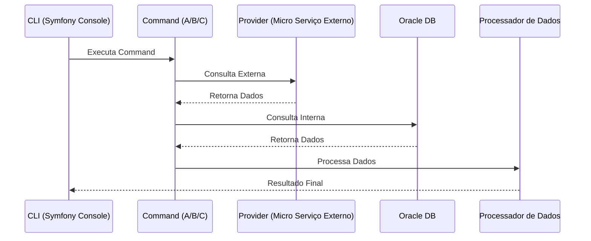
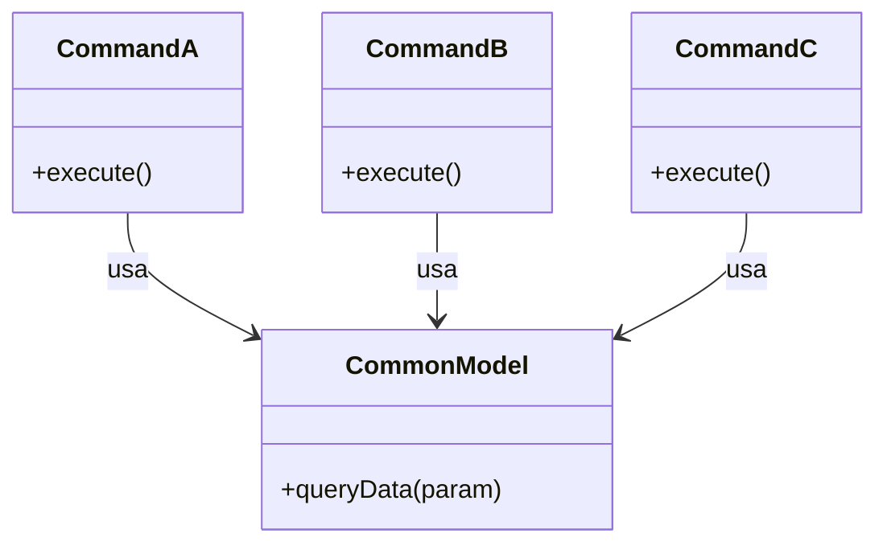
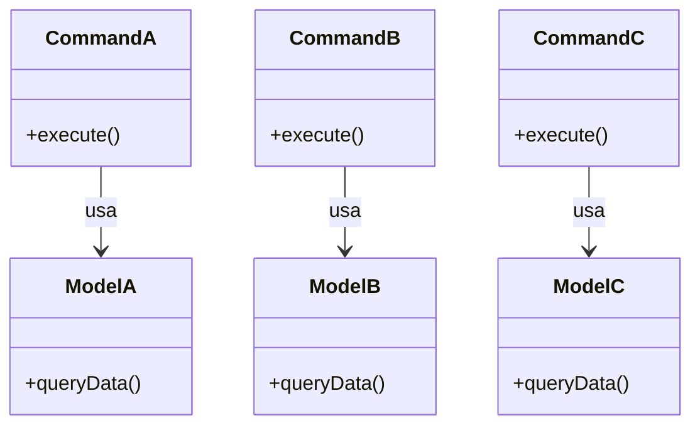

# 🧪 Caso Prático – Aplicando SRP em Commands

## 📌 Contexto – Fluxo de Execução de um Command


Era um projeto **CLI** (Symfony/Console + Oracle DB).  
Cada `Command` executava:
1. Uma **consulta externa** em um determinado *Provider* (outro micro serviço).  
2. Com o resultado, fazia uma **consulta interna** na Base Oracle.  
3. Após isso, processava o dado.  

---

## 💡 Premissas de Uma Boa Ideia 🤔
"*Temos vários commands que fazem coisas muito semelhantes - queries.*"
"*Tem muito código duplicado*"
"*Vamos criar uma consulta genéricona, ai reaproveitamos o código*"

Foi criada uma **CommonModel** com uma query "padrão" utilizada em vários commands (`A`, `B`, `C`). 

## 🔎 Diagrama – Implementação



### 🧑‍💻 Implementação Código
```php
class CommonModel {
    public function queryData(string $param) {
        // Query genérica usada por todos os Commands
        return "SELECT * FROM table WHERE column = '{$param}'";
    }
}

class CommandA {
    public function __construct(private CommonModel $model) {}

    public function execute() {
        $data = $this->model->queryData('A');
        // processa dados de A
    }
}

class CommandB {
    public function __construct(private CommonModel $model) {}

    public function execute() {
        $data = $this->model->queryData('B');
        // processa dados de B
    }
}

class CommandC {
    public function __construct(private CommonModel $model) {}

    public function execute() {
        $data = $this->model->queryData('C');
        // processa dados de C
    }
}
```
### 😎 Só Vantagens: 
- Diminuiu a quantidade de código duplicado.
- Todo mundo pode implementar mais rápido
- Só felicidades!


---


### 📦 Mas... A vida do programdor é uma Caixinha de Surpresas 

💣 Um dia deu problema nessa consulta para um `Command A`.  
- Ajuste feito → resolveu para `A`, mas **quebrou `B`**.  
- Novo ajuste feito → resolveu `B`, mas **impactou `A` e `C`**.  

Isso gerou alto **acoplamento** e **baixa manutenibilidade**.

🦗 "*Ah mas não tinha como pegar isso nos testes?*"

---

## ✅ Solução – Aplicando SRP
Sugestão aplicada: **cada Command possui sua própria Model com sua query**.  

Mesmo que haja duplicação, é uma **duplicação intencional**,  
pois cada classe atende **apenas um cliente** e tem **um único motivo para mudar**.

## 🔎 Diagrama – Implementação - SRP


### 🧑‍💻 Código – Solução
```php
class ModelA {
    public function queryData() {
        return "SELECT * FROM table_A WHERE column = 'A'";
    }
}

class ModelB {
    public function queryData() {
        return "SELECT * FROM table_B WHERE column = 'B'";
    }
}

class ModelC {
    public function queryData() {
        return "SELECT * FROM table_C WHERE column = 'C'";
    }
}

class CommandA {
    public function __construct(private ModelA $model) {}

    public function execute() {
        $data = $this->model->queryData();
        // processa dados de A
    }
}

class CommandB {
    public function __construct(private ModelB $model) {}

    public function execute() {
        $data = $this->model->queryData();
        // processa dados de B
    }
}

class CommandC {
    public function __construct(private ModelC $model) {}

    public function execute() {
        $data = $this->model->queryData();
        // processa dados de C
    }
}
```

### Isso trouxe:
- Código mais **testável**  
- **Manutenção simplificada**  
- Maior **extensibilidade**  
- **Baixo acoplamento**

---

## 🎁 Benefícios da Solução
- Cada `Command` tem sua **própria lógica**  
- Evita **efeito colateral** em outros comandos  
- Facilita **testes unitários/integrados**  
- Segue o princípio **SRP (Single Responsibility Principle)**
