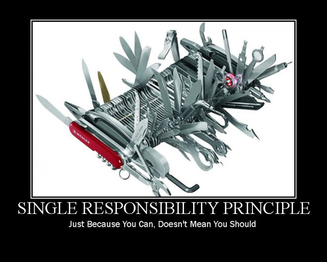
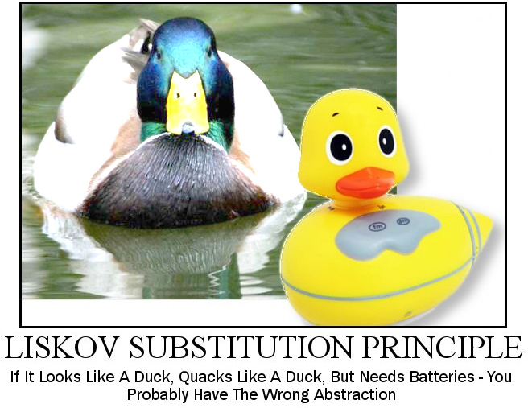
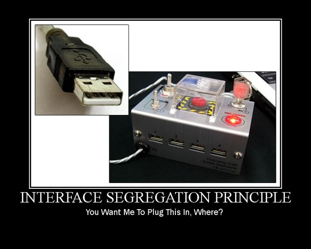
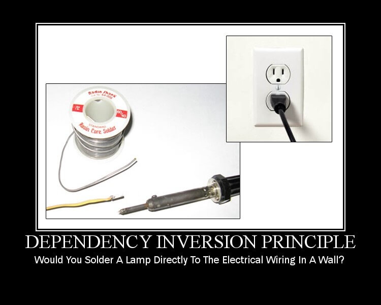

# 🎯 SOLID com PHP

---

## 🎬 Introdução ao SOLID

**📋 O que é SOLID?**
- Princípios de design orientado a objetos
- Criados por Robert C. Martin (Uncle Bob)
- Acrônimo para cinco princípios fundamentais

**🎯 Por que usar SOLID?**
- Código mais limpo e manutenível
- Redução de acoplamento
- Facilita testes e extensibilidade
- Menos "code smells" e dívida técnica

**📌 Agenda:**
1. S - Single Responsibility Principle
2. O - Open/Closed Principle  
3. L - Liskov Substitution Principle
4. I - Interface Segregation Principle
5. D - Dependency Inversion Principle

---

## ⚡ Single Responsibility Principle



---

**📖 Conceito:**
"Uma classe deve ter apenas uma razão para mudar"

**❌ Exemplo Problemático:**
```php
class Order {
    public function addItem(string $item, float $price): void {}
    public function calculateTotal(): float {}
    public function processPayment(): void {}
    public function sendEmail(): void {}
    public function saveToDatabase(): void {}
}

$order = new Order();
$order->addItem("Produto A", 100);
$order->addItem("Produto B", 50);
$order->processPayment();
$order->sendEmail();
$order->saveToDatabase();
```

**✅ Exemplo Corrigido:**
```php
// Classe responsável apenas pelo pedido
class OrderSRP {
    public function addItem(string $item, float $price): void {}
    public function calculateTotal(): float {}
}

// Classe responsável pelo pagamento
class PaymentProcessor {
    public function processPayment(OrderSRP $order): void {}
}

// Classe responsável por enviar emails
class EmailService {
    public function sendOrderConfirmation(OrderSRP $order): void {}
}

// Classe responsável pelo repositório (banco de dados)
class OrderRepository {
    public function save(OrderSRP $order): void {}
}

// Exemplo de uso
$order = new OrderSRP();
$order->addItem("Produto X", 200);
$order->addItem("Produto Y", 80);

$payment = new PaymentProcessor();
$email   = new EmailService();
$repo    = new OrderRepository();

$payment->processPayment($order);
$email->sendOrderConfirmation($order);
$repo->save($order);
```

**🎁 Benefícios:**
- Classes mais coesas e focadas
- Facilidade de teste unitário
- Menos conflitos em trabalho em equipe
- Manutenção simplificada

---

## 🔓 Open/Closed Principle


---


**📖 Conceito:**
"Entidades devem estar abertas para extensão, mas fechadas para modificação"

**❌ Exemplo Problemático:**
```php
class PaymentProcessor {
    public function process($paymentType) {
        if ($paymentType === 'credit_card') {
            // process credit card
        } elseif ($paymentType === 'picpay_card') {
            // process picpay_card
        }
    }
}

$processor = new PaymentProcessor();
$processor->process("credit_card");
$processor->process("picpay_card");
$processor->process("paypal"); // 🚨

```

**✅ Exemplo Corrigido:**
```php
// Abstração para métodos de pagamento
interface PaymentMethod {
    public function process(): void;
}

// Implementação para cartão de crédito
class CreditCardPayment implements PaymentMethod {
    public function process(): void {}
}

// Implementação para Cartão Picpay
class PicpayCardPayment implements PaymentMethod {
    public function process(): void {}
}

// Processador que depende da abstração, não de condições fixas
class PaymentProcessorOCP {
    public function processPayment(PaymentMethod $paymentMethod): void {
        $paymentMethod->process();
    }
}

// Exemplo de uso (correto com OCP)
$processor = new PaymentProcessorOCP();
$processor->processPayment(new CreditCardPayment()); 
$processor->processPayment(new PicpayCardPayment());

// ➕ Para adicionar novos métodos de pagamento (ex.: PixPayment)
// basta criar uma nova classe que implementa PaymentMethod.
// Nenhuma modificação no PaymentProcessor é necessária.
```

**🎁 Benefícios:**
- Fácil adição de novas funcionalidades
- Menos regressões em código existente
- Arquitetura extensível e modular

---

## 🔄 Liskov Substitution Principle



---

**📖 Conceito:**
"Subtipo deve ser substituível por seu tipo base sem alterar o comportamento"

**❌ Exemplo Problemático:**
```php
class Bird {
    public function fly(): void {}
}

class Eagle extends Bird {
    public function fly(): void {}
}

class Penguin extends Bird {
    public function fly(): void {
        // 🚫 Problema: pinguins não voam!
        throw new Exception("Penguins can't fly!");
    }
}

// Exemplo de uso (problema)
$birds = [new Eagle(), new Penguin()];
foreach ($birds as $bird) {
    // Ao chamar fly(), esperamos que todos os "Birds" voem
    $bird->fly(); // 🚨
}

```

**✅ Exemplo Corrigido:**
```php

// Interface para aves que voam
interface FlyingBird {
    public function fly(): void;
}

// Interface para aves que nadam
interface SwimmingBird {
    public function swim(): void;
}

class EagleLSP implements FlyingBird {
    public function fly(): void {}
}

class PenguinLSP implements SwimmingBird {
    public function swim(): void {}
}

// Exemplo de uso (correto com LSP)

// Lista de aves que voam
$flyingBirds = [new EagleLSP()];
foreach ($flyingBirds as $bird) {
    $bird->fly(); // ✅ Todos podem voar sem problemas
}

// Lista de aves que nadam
$swimmingBirds = [new PenguinLSP()];
foreach ($swimmingBirds as $bird) {
    $bird->swim(); // ✅ Todos podem nadar sem problemas
}
```

**🎁 Benefícios:**
- Polimorfismo confiável e previsível
- Prevenção de surpresas desagradáveis
- Herança semanticamente correta

---

## 🧩 Interface Segregation Principle

    

---

**📖 Conceito:**
"Muitas interfaces específicas são melhores que uma interface geral"

**❌ Exemplo Problemático:**
```php
interface Worker {
    public function work();
    public function eat();
    public function sleep();
}

class Human implements Worker {
    public function work(): void {}
    public function eat(): void {}
    public function sleep(): void {}
}

class Robot implements Worker {
    public function work() {}
    public function eat() {}
    public function sleep() {}
}

// Exemplo de uso
$workers = [new Human(), new RobotProblem()];
foreach ($workers as $worker) {
    $worker->work();
    $worker->eat();   // 🚨
    $worker->sleep(); // 🚨 
}
```

**✅ Exemplo Corrigido:**
```php
interface Workable {
    public function work(): void;
}

interface Eatable {
    public function eat(): void;
}

interface Sleepable {
    public function sleep(): void;
}

class Human implements Workable, Eatable, Sleepable {
    public function work(): void {}
    public function eat(): void {}
    public function sleep(): void {}
}

class Robot implements Workable {
    public function work(): void {}
}

// Exemplo de uso (correto com ISP)

// Lista de trabalhadores
$workers = [new Human(), new Robot()];
foreach ($workers as $worker) {
    $worker->work(); // ✅ Tanto Human quanto Robot trabalham
}

// Lista de quem come
$eaters = [new Human()];
foreach ($eaters as $eater) {
    $eater->eat(); // ✅ Apenas Human
}

// Lista de quem dorme
$sleepers = [new Human()];
foreach ($sleepers as $sleeper) {
    $sleeper->sleep(); // ✅ Apenas Human
}
```

**🎁 Benefícios:**
- Interfaces enxutas e específicas
- Sem métodos forçados ou vazios
- Melhor organização e coesão

---

## 🔌 Dependency Inversion Principle



---

**📖 Conceito:**
"Dependa de abstrações, não de implementações concretas"

**❌ Exemplo Problemático:**
```php
class MySQLConnection {
    public function connect() {}
}

class UserRepository {
    private $connection;
    
    public function __construct() {
        $this->connection = new MySQLConnection(); // 🚨
    }
}

$repo = new UserRepository();
```

**✅ Exemplo Corrigido:**
```php
interface DatabaseConnection {
    public function connect(): void;
}

class MySQLConnectionDIP implements DatabaseConnection {
    public function connect(): void {}
}

class PostgreSQLConnection implements DatabaseConnection {
    public function connect(): void {}
}

class UserRepository {
    private DatabaseConnection $connection;

    // ✅ Depende da abstração (interface), não da implementação concreta
    public function __construct(DatabaseConnection $connection) {
        $this->connection = $connection;
    }

    public function saveUser(array $user): void {}
}

// Exemplo de uso (correto com DIP)

// Podemos usar MySQL
$mysqlRepo = new UserRepository(new MySQLConnectionDIP());

// Ou PostgreSQL, sem mudar o UserRepository
$pgsqlRepo = new UserRepository(new PostgreSQLConnection());

```

**🎁 Benefícios:**
- Baixo acoplamento entre componentes
- Fácil substituição de implementações
- Melhor testabilidade com mocks
- Arquitetura flexível e sustentável

---

## 🧪 Caso Prático


[🔗 Caso Prático: Single Responsibility Principle](./case_srp.md)


---

## 🏁 Conclusão

**📚 Resumo dos Princípios:**
- S - Single Responsibility: Uma classe, uma responsabilidade
- O - Open/Closed: Estenda, não modifique
- L - Liskov Substitution: Substituição segura
- I - Interface Segregation: Interfaces específicas
- D - Dependency Inversion: Dependa de abstrações

**💡 Recomendações Práticas:**
- Aplique gradualmente em projetos existentes
- Evite over-engineering
- Foque em pontos de maior complexidade
- Combine com padrões de projeto

## ✨ Citação de Robert C. Martin (Uncle Bob)

📖 **Reflexão sobre Simplicidade no Código**

> 💡 *“Basta escrever código simples". 
>Este é um bom conselho.  
> No entanto, se os anos nos ensinaram alguma coisa, é que a simplicidade requer disciplinas guiadas por princípios.  
> São esses princípios que definem a simplicidade.  
> São essas disciplinas que obrigam os programadores a produzir código que se inclina para a simplicidade.*  
>
> 🚫 *A melhor maneira de complicar as coisas é dizer a todos para ‘serem simples’ e não dar mais nenhuma orientação.”*

---

👤 **Autor:** Robert C. Martin (*Uncle Bob*)  
📅 Publicado em 18 de outubro de 2020  
🔗 Fonte: [Solid Relevance – The Clean Coder Blog](https://blog.cleancoder.com/uncle-bob/2020/10/18/Solid-Relevance.html)


**🚀 Próximos Passos:**
- SOLID em GO
- SOLID aprofundado
- Padrões de projeto (Design Patterns)
- Arquitetura limpa (Clean Architecture)

**📖 Material de Apoio:**

- 🔗 [**Blog do Uncle Bob – Solid Relevance**](https://blog.cleancoder.com/uncle-bob/2020/10/18/Solid-Relevance.html)  
- 💻 [**Repositório no GitHub**](https://github.com/wellalencarweb/solid)  
- 📚 **Livro:** *Clean Code* – Robert C. Martin  
- 🐘 [**Documentação Oficial do PHP**](https://www.php.net)

